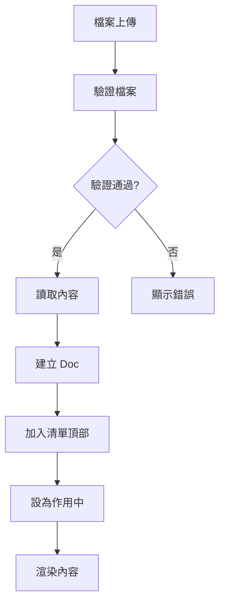

# Design Document

## Overview

TXT 檔案檢視器是一個純前端的單頁應用程式，採用 React + TypeScript + Vite 技術棧。應用程式採用三欄式佈局：固定寬度的左側檔案清單、可捲動的右側內容區域，以及固定在底部的工具列。所有資料都存儲在記憶體中，不需要後端服務或本地持久化。

## Architecture

### 技術棧
- **前端框架**: React 18 + TypeScript 5
- **建置工具**: Vite 5
- **套件管理**: pnpm 9
- **部署**: GitHub Pages (靜態網站)
- **瀏覽器支援**: 現代瀏覽器 (Chrome 90+, Firefox 88+, Safari 14+)

### 應用程式架構
```
App
├── Sidebar (檔案清單)
├── ContentView (內容顯示)
└── BottomBar (搜尋與新增)
```

### 狀態管理
使用 React 的 useState 和 useContext 進行狀態管理，不引入額外的狀態管理庫。

## Components and Interfaces

### 資料模型

```typescript
interface Doc {
  id: string;          // UUID v4
  name: string;        // 檔案名稱
  size: number;        // 檔案大小 (bytes)
  content: string;     // 檔案內容
  scrollTop?: number;  // 捲軸位置 (記憶體暫存)
}

interface SearchHit {
  start: number;       // 命中開始位置
  end: number;         // 命中結束位置
}

interface SearchState {
  query: string;       // 搜尋關鍵字
  hits: SearchHit[];   // 所有命中結果
  currentIndex: number; // 當前命中索引
}

interface AppState {
  docs: Doc[];
  activeId: string | null;
  searchState: SearchState;
}
```

### 核心元件

#### App Component
- 管理全域狀態
- 處理檔案上傳邏輯
- 協調各子元件間的互動

#### Sidebar Component
```typescript
interface SidebarProps {
  docs: Doc[];
  activeId: string | null;
  onSelectDoc: (id: string) => void;
}
```
- 顯示檔案清單
- 處理檔案切換
- 管理作用中狀態的視覺回饋

#### ContentView Component
```typescript
interface ContentViewProps {
  doc: Doc | null;
  searchState: SearchState;
  onScroll: (scrollTop: number) => void;
}
```
- 渲染檔案內容
- 處理搜尋結果高亮
- 管理捲軸位置

#### BottomBar Component
```typescript
interface BottomBarProps {
  searchState: SearchState;
  onSearch: (query: string) => void;
  onNavigateSearch: (direction: 'next' | 'prev') => void;
  onAddFile: () => void;
}
```
- 提供搜尋介面
- 處理檔案新增觸發
- 顯示搜尋結果統計

### 工具函數

#### 檔案處理
```typescript
// 檔案驗證
function validateFile(file: File): { valid: boolean; error?: string }

// 檔案讀取
function readFileAsText(file: File): Promise<string>

// UUID 生成
function generateId(): string
```

#### 搜尋功能
```typescript
// 搜尋執行
function searchInText(text: string, query: string): SearchHit[]

// 正則表達式轉義
function escapeRegExp(string: string): string
```

## Data Models

### 檔案生命週期
1. **上傳階段**: 檔案選擇 → 驗證 → 讀取 → 建立 Doc 物件
2. **顯示階段**: 加入清單 → 設為作用中 → 渲染內容
3. **互動階段**: 切換檔案 → 搜尋 → 捲動記憶

### 狀態更新流程


### 搜尋狀態管理
- 搜尋只在當前作用中的檔案內執行
- 即時搜尋：每次輸入變更都觸發搜尋
- 結果快取：同一檔案的搜尋結果會暫存直到檔案切換

## Error Handling

### 檔案上傳錯誤
- **格式錯誤**: 檢查副檔名，顯示「僅支援 .txt」
- **大小錯誤**: 檢查檔案大小，顯示「檔案過大」
- **編碼錯誤**: FileReader 失敗時顯示「無法解析文字」

### 搜尋錯誤
- **空搜尋**: 清空所有高亮，重置搜尋狀態
- **無結果**: 顯示「0/0」，禁用導航按鈕

### 系統錯誤
- **記憶體不足**: 大檔案載入失敗時的降級處理
- **瀏覽器相容性**: 使用 feature detection 確保核心功能可用

## Testing Strategy

### 單元測試
- **工具函數測試**: 檔案驗證、搜尋邏輯、UUID 生成
- **元件測試**: 各元件的 props 處理和事件觸發
- **狀態管理測試**: 狀態更新邏輯的正確性

### 整合測試
- **檔案上傳流程**: 從選擇到顯示的完整流程
- **檔案切換**: 多檔案間的切換和狀態保持
- **搜尋功能**: 搜尋執行和結果導航

### 使用者測試場景
- **基本流程**: 上傳檔案 → 檢視內容 → 搜尋文字
- **多檔案操作**: 上傳多個檔案 → 切換檢視 → 位置記憶
- **錯誤處理**: 上傳無效檔案 → 確認錯誤提示

### 效能測試
- **大檔案處理**: 測試 5MB 檔案的載入和渲染效能
- **搜尋效能**: 測試大檔案中的搜尋響應時間
- **記憶體使用**: 監控多檔案載入時的記憶體消耗

## UI/UX Design Specifications

### 佈局規格
- **左側邊欄**: 固定寬度 280px，淺灰背景 (#f8f9fa)
- **右側內容**: 動態寬度，最大內容寬度 760px，居中對齊
- **底部工具列**: 固定高度 60px，與右側內容區對齊

### 色彩規範
- **主背景**: #ffffff
- **側邊欄背景**: #f8f9fa
- **作用中項目**: #e3f2fd (淺藍)
- **hover 效果**: #f5f5f5
- **搜尋高亮**: #ffeb3b (黃色背景)
- **當前搜尋**: #ff9800 (橘色外框)

### 字型規範
- **介面字型**: system-ui, -apple-system, sans-serif
- **內容字型**: 'Courier New', Consolas, monospace
- **字型大小**: 14px (介面), 16px (內容)
- **行高**: 1.5 (介面), 1.7 (內容)

### 互動效果
- **按鈕 hover**: 透明度變化 (opacity: 0.8)
- **檔案切換**: 無動畫，即時切換
- **搜尋跳轉**: 平滑捲動 (scroll-behavior: smooth)
- **載入狀態**: 簡單的 loading 指示器

### 響應式設計
- **最小寬度**: 1024px (不支援行動裝置)
- **側邊欄**: 固定寬度，不響應式調整
- **內容區**: 自適應剩餘空間

## Implementation Notes

### 關鍵技術決策
1. **純前端實作**: 無後端依賴，適合 GitHub Pages 部署
2. **記憶體存儲**: 不使用 localStorage，簡化 v1.0 實作
3. **一次性渲染**: 不實作虛擬捲動，保持實作簡單
4. **即時搜尋**: 提供更好的使用者體驗

### 效能考量
- **檔案大小限制**: 5MB 上限避免瀏覽器記憶體問題
- **搜尋最佳化**: 使用原生正則表達式，避免複雜的搜尋演算法
- **DOM 最佳化**: 搜尋高亮使用 document fragment 減少重排

### 可擴展性設計
- **元件化架構**: 便於後續功能擴展
- **型別定義**: 完整的 TypeScript 介面定義
- **狀態分離**: 清晰的狀態管理便於後續重構